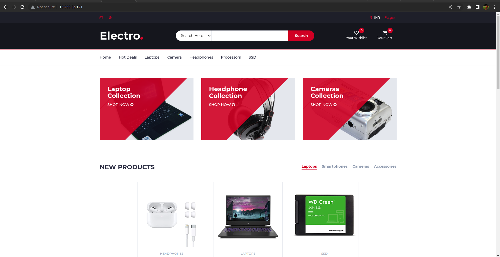
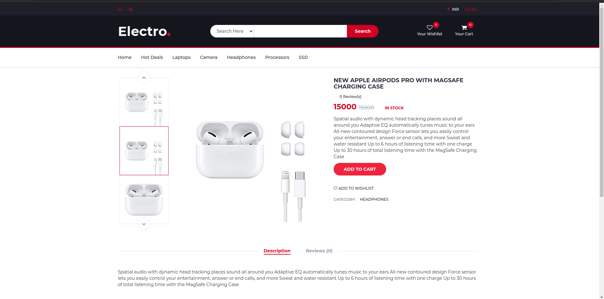

# Gadgo
Live server = http://13.233.56.121/

Gadgo or Electro is a ecommerce web app for buying electronic gadgets.

## How to Setup

 - Clone this repositary
 - Create Python virtual environment
 - Do pip install -r requirements.txt
 - Install postgres
 - Open postgres and create a databse and user
 - Grant all previlages to the user
 - Add the db details in elctro/settings.py 
 - Set the port number as 5432
 - Do python manag.py migrate(for model mirations to reflect on your db)
 - Do python manage.py createsuperuser(for creating an admin)
 - Then Python manage.py runserver to run the server 

## Features

User:

* User signup via email and google authentication
- User siginin
- User can add items to wishlist
- User can add items to cart
- Checkout
- Address can be selected from home icon above or custom icon
- Payment
- Success Invoice which can be downloaded
- User can rate and review the product he bought
- User can search products
- User can filter products
- user can keep the track of order by going to user section(which is a user icon on the navbar)
Admin:

- Admin side can be accessed by adding '/proadmin' on the base url
- Here Admin can see the Total products and sales in graph
- Admin Can manage orders
- change the state of orders which will be reflected on users side
- Add products or update the stock
- Can see the amount of transactions happened
- Manage Users by Blocking and unblocking them
## Screenshots
Home

Product Page

